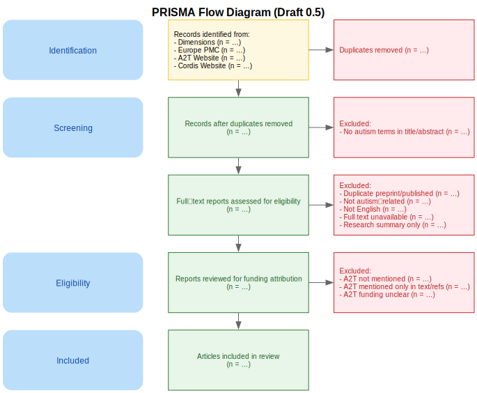

# Protocol – *Draft for Review*  #

**Study:** *Autistic Participation Reporting in Autism Research Articles Funded by AIMS-2-TRIALS: A Corpus Analysis Informed by GRIPP2-LF*  
**Version:** 0.4 – *Draft under review by research collaborators*  
**Date:** 2025-06-02

*This protocol is a preliminary draft. It is intended for collaborative feedback and discussion among project participants and may be modified or restructured based on collective input.*

*The structure and implementation of this protocol may be adapted based on the number of coders and reviewers available to participate in this study, in order to ensure feasibility while maintaining methodological transparency.*

# Table of Contents #

- [Protocol – *Draft for Review*](#protocol--draft-for-review)

  ## Phase A – Corpus-Building *(Performed by the First reviewer)*

  1. [Preliminary Considerations](#preliminary-considerations)
  2. [PRISMA Flow Diagram (Draft)](#prisma-flow-diagram-draft)
  3. [Step 1 – Retrieve records from Dimensions](#step-1--retrieve-records-from-dimensions)
  4. [Step 2 – Retrieve records from Europe PMC](#step-2--retrieve-records-from-europe-pmc)
  5. [Step 3 – Retrieve records from the CORDIS website](#step-3--retrieve-records-from-the-cordis-website)
  6. [Step 4 – Retrieve records from the AIMS-2-TRIALS project website](#step-4--retrieve-records-from-the-aims-2-trials-project-website)
  7. [Step 5 – De-duplication Across Sources](#step-5--de-duplication-across-sources)
  8. [Step 6 – Screen for autism-related terms in title/abstract](#step-6--screen-for-autism-related-terms-in-titleabstract)
  9. [Step 7 – Manual full-text screening (exclusion rules)](#step-7--manual-full-text-screening-exclusion-rules)
  10. [Step 8 – Detailed analysis of funding attribution](#step-8--detailed-analysis-of-funding-attribution)

  ## Phase B – Corpus Verification (Funding Attribution)

  1. [Preparatory extraction — First reviewer (Phase A recap)](#1--preparatory-extraction--first-reviewer-phase-a-recap)
  2. [Reviewer training — eligibility-rules comprehension check](#2--reviewer-training--eligibility-rules-comprehension-check)
  3. [Independent blind verification (secondary reviewers)](#3--independent-blind-verification-secondary-reviewers)
  4. [Resolution of discrepancies](#4--resolution-of-discrepancies)
  5. [Documentation & versioning](#5--documentation--versioning)

  ## Phase C – Corpus Analysis Informed by GRIPP2-LF

  1. [Step 1 – Develop the GRIPP2-LF coding framework](#step-1--develop-the-gripp2-lf-coding-framework)
  2. [Step 2 – Joint calibration on a common subset](#step-2--joint-calibration-on-a-common-subset)
  3. [Step 3 – Workload division with single primary coding](#step-3--workload-division-with-single-primary-coding)
  4. [Step 4 – Secondary quality-control coding](#step-4--secondary-quality-control-coding)
  5. [Step 5 – Consolidation and master dataset creation](#step-5--consolidation-and-master-dataset-creation)
  6. [Step 6 – Descriptive and comparative analysis](#step-6--descriptive-and-comparative-analysis)

---

## Phase A – Corpus-Building ##
*(Performed by the **First reviewer**)*  

### Preliminary Considerations

- **Objective:** Justify the prioritization of full-text–searchable academic databases and external repositories over platforms like Scopus, PubMed, Google Scholar, or the official AIMS-2-TRIALS website.

- **Rationale:**

  - A Boolean search in **Scopus** or **PubMed** using terms like **“autism” OR “autistic” OR “ASD”** (in the **title** or in the **abstract**) and **“AIMS-2-TRIALS” OR “777394”** (in **all fields**) is **insufficient**. These platforms do **not support full-text search**, which means they may overlook mentions of funding in crucial sections such as *Funding*, *Acknowledgements*, or *Conflicts of Interest*.

  - **Google Scholar**, although broad in coverage, does **not support export of structured metadata** (e.g., `.bib` format), and **does not systematically provide DOIs**, making it unsuitable for systematic corpus construction and reproducibility.

  - The [**official AIMS-2-TRIALS Publications page**](https://www.aims-2-trials.eu/) is **used as a supplementary source**, but not prioritized. It does **not include DOIs**, and there is **no standardized export option**. Moreover, it contains:
    - Duplicate entries  
    - Broken links  
    - Publications funded solely by **EU-AIMS** (the previous project), not **AIMS-2-TRIALS**

  - The **CORDIS** project page does provide **DOIs**, but similarly lacks export functionality for structured metadata.

- **Source prioritization (based on metadata quality and reproducibility):**

  1. **Dimensions** – full-text searchable; `.bib` export supported  
  2. **Europe PMC** – full-text searchable; structured export supported  
  3. **CORDIS project page** – DOIs available; no export  
  4. **Official AIMS-2-TRIALS Publications page** – no DOIs; no export

This prioritization ensures that the resulting corpus is robust, reproducible, and based on reliable metadata.

---
# PRISMA Flow Diagram (Draft) #

This diagram visualizes **Phase A – Corpus-Building** (see below) using a PRISMA-style flow.  
It was created using the **Graphviz DOT language** and is [available in the repository](./prisma_diagram/prisma_diagram.dot).

---

### Step 1 – Retrieve records from Dimensions
- **Source:** [Dimensions](https://app.dimensions.ai/) – supports full-text and grant-based searches
- **Objective:** Identify all publications that mention both autism-related terms and the AIMS-2-TRIALS project (or its grant number), using a comprehensive query across all searchable fields.
- **Action:**
  - Perform a search across **all fields** using the following query:  
    *(Coverage: records published up to **31 May 2025**, inclusive)*  
    `("777394" OR "AIMS-2-TRIALS") AND ("autism" OR "autistic" OR "ASD")`
  - Additionally, test common misspellings such as `"AIMS2TRIALS"`, `"AIMS2-TRIALS"`, and `"AIMS-2TRIALS"` to check for overlooked records.
  - Export the full result set in `.bib` format for import into JabRef.

### Step 2 – Retrieve records from Europe PMC
- **Source:** [Europe PMC](https://europepmc.org/)
- **Objective:** Identify additional autism-related publications acknowledging AIMS-2-TRIALS support.
- **Action:**
  - Perform a search across **title** and **abstract** using the following query:  
    *(Coverage: records published up to **31 May 2025**, inclusive)*  
    `(TITLE:(autism OR autistic OR ASD) OR ABSTRACT:(autism OR autistic OR ASD)) AND ("AIMS-2-TRIALS" OR "777394")`
  - Export the complete result set.

### Step 3 – Retrieve records from the CORDIS website
- **Source:** [CORDIS – AIMS-2-TRIALS project results](https://cordis.europa.eu/project/id/777394/results)
- **Objective:** Review peer-reviewed outputs linked to AIMS-2-TRIALS.
- **Action:**
  - Manually screen all records listed on the results page as of 31 May 2025.

### Step 4 – Retrieve records from the AIMS-2-TRIALS project website
- **Source:** [AIMS-2-TRIALS Publications page](https://www.aims-2-trials.eu/)
- **Objective:** Identify relevant entries on the official project website.
- **Action:**
  - Manually screen each listed publication as of 31 May 2025.

### Step 5 – De-duplication Across Sources
- **Tool:** JabRef  
- **Objective:** Ensure each unique article is represented only once in the master corpus while preserving its provenance.  
- **Action:**  
  - Assign each reference to a JabRef Source group corresponding to its origin (Dimensions, Europe PMC, CORDIS, or the AIMS-2-TRIALS website).  
  - Compare all records imported in Steps 1–4 using the DOI as the primary identifier for duplicate detection.  
  - If the same DOI appears across multiple sources, retain a single consolidated entry.  
  - Preserve source traceability by assigning the reference to all relevant Source groups, allowing a single entry to reflect multiple origins.

### Step 6 – Screen for autism-related terms in title/abstract  
- **Objective:** Ensure that only publications explicitly addressing autism are retained for eligibility assessment.  
- **Action:**  
  - Before performing this screening, verify that all entries contain an abstract. If missing, manually retrieve and add the abstract from the publisher’s website or article PDF.  
  - Exclude any record that does **not** mention **“autism”**, **“autistic”**, or **“ASD”** in the **title** *and/or* **abstract**.  
  - This step ensures topic relevance before proceeding to full-text eligibility review.

### Step 7 – Manual full-text screening (exclusion rules)  
- **Objective:** Ensure that only articles that are directly relevant to autism and that clearly acknowledge funding from AIMS-2-TRIALS are included in the corpus.  
- **Action:**  
  Exclude any entry that meets **one or more** of the following criteria:

  1. Mentions **“autism”, “autistic”, or “ASD”** in the abstract **but the article is not directly about autism**  
  2. Article language is **not English**  
  3. Entry is a **preprint** that has since been published in a peer-reviewed journal  
  4. **AIMS-2-TRIALS** (or grant **777394**) is mentioned **only** in the body text or bibliography and **not** in a funding-related section (e.g. *Acknowledgements*, *Funding*, *Conflict of Interest (COI)*)  

### Step 8 – Detailed analysis of funding attribution  
- **Objective:** Ensure that only publications explicitly funded by AIMS-2-TRIALS are retained in the corpus, based on strict and verifiable funding attribution criteria.  
- **Action:**  
  - For each remaining entry, perform a manual review of the **Funding**, **Acknowledgements**, and **Conflict of Interest (COI)** sections.  
  - Determine whether the article explicitly states that **AIMS-2-TRIALS funded the research project or one or more of the authors**.  
  - Apply the following inclusion/exclusion rules:
    - If **AIMS-2-TRIALS** is explicitly mentioned in a **Funding** section as having funded the research or the authors, the entry is **included**.
    - If the mention appears **only** in a non-funding section (e.g. *Acknowledgements*, *COI*), the entry is **excluded**, **unless** the publication is also listed on the [official AIMS-2-TRIALS Publications page](https://www.aims-2-trials.eu/).
    - If the article uses the term **“support”** to refer to AIMS-2-TRIALS, interpret it as *financial* support **only** when it appears in a **Funding** section. If the word “support” appears only outside that context, cross-verification with the Publications page is required to retain the entry.

---

## Phase B – Corpus Verification (Funding Attribution)  

> **Scope.** Phase B provides an *independent, blinded* check of every funding-attribution decision made during Phase A.  
> Secondary reviewers see only the **article title** and the **sentence-level excerpt(s)** captured by the primary reviewer; they do **not** see the primary reviewer’s eligibility code.

---

### 1 · Preparatory extraction — First reviewer (Phase A recap)  
- **Objective:** Capture transparent, citable evidence of AIMS-2-TRIALS funding/support for every record.  
- **Action:**  
  - For **every entry** (even exclusions that mention only “support”), the primary reviewer records:  
    1. The **sentence(s)** that contain the AIMS-2-TRIALS funding or support statement.  
    2. The **section heading** in which that statement appears (e.g. *Funding*, *Acknowledgements*, *COI*).  
    3. A binary code (*AIMS-2-TRIALS support eligible? yes / no*).  
  - An auto-attribution script confirms linkage by matching the first ten words of the extracted sentence(s) against the article full text; discrepancies are flagged for manual review.

---

### 2 · Reviewer training — eligibility-rules comprehension check
- **Objective:** Ensure uniform application of Phase-A eligibility rules before blind verification begins.  
- **Action:**  
  1. **Calibration set (20 excerpts):** Each prospective secondary reviewer independently judges *inclusion* or *exclusion* for 20 randomly sampled excerpts (section heading + sentence(s)).  
  2. **Consensus meeting (eligibility-rules focus):** Divergent judgments are revisited, with explicit reference to the Phase-A eligibility rules, under the guidance of the project lead until unanimous agreement is reached.  

---

### 3 · Independent blind verification (secondary reviewers)  
- **Objective:** Obtain an independent eligibility decision for **every** extracted passage.  
- **Action:**  
  1. **Work allocation:** Each excerpt is assigned to exactly one certified secondary reviewer who did **not** participate in Phase A extraction, ensuring complete separation of roles.
  2. **Blinded NocoDB form:** Secondary reviewers view only:  
     - the **section heading**, and  
     - the **extracted sentence(s)**.  
     The Phase-A eligibility code is hidden.  
  3. **Data captured:** Secondary reviewers enter:
     - a binary judgment (*funded by AIMS-2-TRIALS? yes / no*), and  
     - optional comments.  
  4. **Agreement rule:**  
      - **100 % concordance** is required between primary and secondary reviewers on the binary judgment (*funded by AIMS-2-TRIALS? yes / no*).  
     - Any discordance, however minor, triggers the discrepancy-resolution pathway.

---

### 4 · Resolution of discrepancies  
- **Objective:** Resolve all disagreements so that the final corpus is error-free.  
- **Action:**  
  1. **Automated flagging:** NocoDB’s *Comparison* view automatically highlights every excerpt for which the eligibility attribution recorded by the **primary reviewer** and that of the **secondary reviewer** are not in 100 % concordance.
  2. **Consensus attempt:** Primary and secondary reviewers confer (asynchronously or live) to reach agreement.  
  3. **Tertiary adjudication:** If consensus fails, a tertiary reviewer renders a binding decision and records a rationale.   
  4. **Corpus lock:** The corpus is marked **Approved** only when every excerpt carries a unanimous eligibility label.

---

### 5 · Documentation & versioning  
- **Public release after corpus lock:**  
  - An **anonymised verification table** (with reviewer identifiers removed),  
  - the **definitive corpus list** (structured file containing year, authors, title, DOI, journal, etc.), and  
  - the corresponding **`.bib` file** are published together in the project’s public GitHub repository at the end of Phase B, enabling full external scrutiny.  

---

## Phase C – Corpus Analysis Informed by GRIPP2-LF ##

*(Performed by two **Primary coders** — **PC-1** and **PC-2** — assisted by a **Secondary coder** (**SC**) who carries out quality-control checks. Final arbitration by a **Third reviewer** if needed.)*  

### Step 1 – Develop the GRIPP2-LF coding framework  
- **Objective:** Convert every GRIPP2-LF item into clear variables and decision rules.  
- **Action:**  
  1. Draft a coding template linking the **five GRIPP2-LF domains** (Aim, Methods, Study Results, Discussion, Reflections) to **item-level variables** (e.g., *“Aim of PPI stated?”* → Yes / No / Partially).  
  2. Provide concrete examples and edge-case guidance for each item.  
  3. Pilot the template on **three randomly chosen articles**; revise wording or categories if Primary coders disagree.

---

### Step 2 – Joint calibration on a common subset  
- **Objective:** Achieve acceptable inter-rater agreement before dividing the workload.  
- **Action:**  
  1. **PC-1** and **PC-2** independently code **10 % of the corpus**.  
  2. Compute **Cohen’s κ** for every item.  
  3. If overall κ ≥ 0.70 and no item falls below 0.60, proceed to Step 3.  
  4. Otherwise, discuss disagreements, and repeat calibration on a *new* 5 % sample until the threshold is met.

---

### Step 3 – Workload division with single primary coding  
- **Objective:** Code the remaining articles efficiently while preserving traceability.  
- **Action:**  
  1. Randomly split the **uncoded 90 %** of the corpus so that **PC-1** and **PC-2** each receive roughly half.  
  2. Each Primary coder enters data through a custom web-form built with **NocoDB**; the form automatically captures coder ID, article ID, and timestamp and stores all records in a central database for later reconciliation.
  3. Flag uncertainties with a standard comment field for later inspection.

---

### Step 4 – Secondary quality-control coding  
- **Objective:** Verify a representative subset of single-coded articles for accuracy.  
- **Action:**  
  1. **SC** draws a **stratified random 15 % sample** from *each* Primary coder’s batch.  
  2. SC codes this sample independently using the same codebook.  
  3. Compute κ between SC and the corresponding Primary coder.  
  4. **If κ ≥ 0.70** for *both* primary batches, accept the coding as valid.  
  5. **If κ < 0.70** for either batch:  
     - Draw an **additional 15 % sample** from that batch.  
     - SC re-codes; recalculate κ.  
     - Repeat until κ ≥ 0.70 or the full batch has been double-coded.  
  6. Document all disagreements; unresolved items go to the Third reviewer for final decision.

---

### Step 5 – Consolidation and master dataset creation  
- **Objective:** Produce a clean, consensus-level dataset ready for analysis.  
- **Action:**  
  1. Merge reconciled codes from Primary and Secondary coders into a **master file** (one row per article, one column per GRIPP2-LF variable).  
  2. Append auxiliary variables (publication year, journal, study design, funding type) gathered in Phases A–B.  
  3. Log any missing or indeterminate values with a standard reason code (e.g., “not reported”).

---

### Step 6 – Descriptive and comparative analysis  
- **Objective:** Quantify patterns of autistic-participation reporting and explore associations with study characteristics.  
- **Action:**  
  1. Calculate frequencies and proportions for each GRIPP2-LF item (e.g., % of studies stating a PPI aim).  
  2. Generate cross-tabulations to explore patterns — for example,  
   how often each GRIPP2-LF item is reported depending on the **year of publication**, the **type of study**, or the **type of funding**.
  3. Visualise results with bar charts, heatmaps, or similar figures for the manuscript.  
  4. Draft a narrative synthesis that complements the quantitative results by highlighting:
    - **Common reporting gaps**: Identify GRIPP2-LF items that are most frequently missing or underreported across studies.
    - **Illustrative examples**: Describe publications that provide relatively detailed reporting of autistic participation, noting the GRIPP2-LF domains covered and how they are addressed.
    - **Observed patterns**: Examine how reporting practices differ by publication year, study design, or funding context, noting where certain GRIPP2-LF items appear more or less frequently.
    - **Implications for future reporting**: Identify areas where reporting could be strengthened in future autism research publications.

---

*End of protocol*
