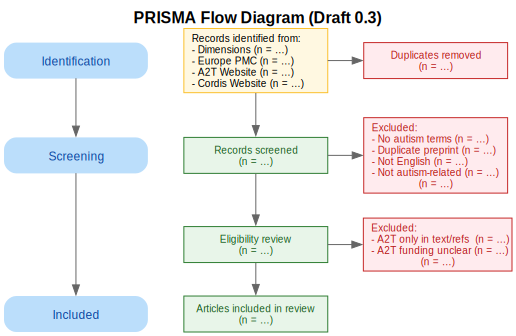

# Protocol – *Draft for Review*  #

**Study:** *Autistic Participation Reporting in Autism Research Articles Funded by AIMS-2-TRIALS: A Corpus Analysis Informed by GRIPP2-LF*  
**Version:** 0.2 – *Draft under review by research collaborators*  
**Date:** 2025-05-29 

*This protocol is a preliminary draft. It is intended for collaborative feedback and discussion among project participants and may be modified or restructured based on collective input.*

*The structure and implementation of this protocol may be adapted based on the number of coders and reviewers available to participate in this study, in order to ensure feasibility while maintaining methodological transparency.*

# Table of Contents #

- [Protocol – *Draft for Review*](#protocol--draft-for-review)
  - [Phase A – Corpus-Building](#phase-a--corpus-building)
    - [Preliminary Considerations](#preliminary-considerations)
    - [PRISMA Flow Diagram (Draft)](#prisma-flow-diagram-draft)    
    - [Step 1 – Retrieve records from Dimensions](#step-1--retrieve-records-from-dimensions)
    - [Step 2 – Initial screening in JabRef](#step-2--initial-screening-in-jabref)
    - [Step 3 – Manual full-text screening (exclusion rules)](#step-3--manual-full-text-screening-exclusion-rules)
    - [Step 4 – Supplementary search in Europe PMC](#step-4--supplementary-search-in-europe-pmc)
    - [Step 5 – Screening the CORDIS website – AIMS-2-TRIALS page](#step-5--screening-the-cordis-website--aims-2-trials-page)
    - [Step 6 – Screening the project website](#step-6--screening-the-project-website)
    - [Step 7 – Detailed analysis of funding attribution](#step-7--detailed-analysis-of-funding-attribution)
  - [Phase B – Corpus Verification](#phase-b--corpus-verification)
    - [1 · Preparatory extraction — First reviewer](#1--preparatory-extraction--first-reviewer)
    - [2 · Independent check — Second reviewer](#2--independent-check--second-reviewer)
    - [3 · Resolution of discrepancies](#3--resolution-of-discrepancies)
  - [## Phase C – Corpus Analysis Informed by GRIPP2-LF ##](#phase-c--corpus-analysis-informed-by-gripp2-lf)
    - [Step 1 – Develop the GRIPP2-LF coding framework](#step-1--develop-the-gripp2-lf-coding-framework)
    - [Step 2 – Joint calibration on a common subset](#step-2--joint-calibration-on-a-common-subset)
    - [Step 3 – Workload division with single primary coding](#step-3--workload-division-with-single-primary-coding)
    - [Step 4 – Secondary quality-control coding](#step-4--secondary-quality-control-coding)
    - [Step 5 – Consolidation and master dataset creation](#step-5--consolidation-and-master-dataset-creation)
    - [Step 6 – Descriptive and comparative analysis](#step-6--descriptive-and-comparative-analysis)

---

## Phase A – Corpus-Building ##
*(Performed by the **First reviewer**)*  

### Preliminary Considerations
- **Objective:** Justify the use of full-text–searchable academic databases and external repositories rather than relying on Scopus, PubMed, Google Scholar, or the official AIMS-2-TRIALS website.  
- **Explanation:**  
  - A Boolean search in **Scopus** or **PubMed** using terms like **“autism” OR “autistic” OR “ASD”** (in the **title**) and **“AIMS-2-TRIALS” OR “777394”** (in **all fields**) is **not effective**, because these platforms do **not support full-text search**. As a result, they may miss critical mentions of funding within sections such as *Funding*, *Acknowledgements*, or *COI*.  
  - **Google Scholar**, while broader in coverage, does **not allow export of structured metadata** (e.g., in `.bib` format), making it unsuitable for systematic corpus construction and analysis.  
  - The [**official AIMS-2-TRIALS Publications page**](https://www.aims-2-trials.eu/) is not structured for automated querying or screening. It includes:  
    - **Duplicate records**  
    - **Broken or missing links**  
    - **Publications funded only by EU-AIMS** (the previous project) and not by AIMS-2-TRIALS  
  - For these reasons, a reliable, exportable, full-text–searchable database such as **Dimensions** is required to construct a valid and reproducible corpus.

---
# PRISMA Flow Diagram (Draft) #

This diagram visualizes **Phase A – Corpus-Building** (see below) using a PRISMA-style flow.  
It was created using the **Graphviz DOT language** and is [available in the repository](./prisma_diagram/prisma_diagram.dot).

---

### Step 1 – Retrieve records from Dimensions  
- **Database:** [Dimensions](https://app.dimensions.ai/) (supports full-text & grant searching)  
- **Objective:** Identify all publications that mention both autism-related terms and AIMS-2-TRIALS (or its grant number), using a comprehensive query applied to all searchable fields.  
- **Action:**  
  - Perform a search in Dimensions using the following query across **all fields**  
    *(coverage: records published up to **31 May 2025**, inclusive)*:  
    `("777394" OR "AIMS-2-TRIALS") AND ("autism" OR "autistic" OR "ASD")` 
  - Retrieve the full set of matching records.  
  - **Export** the complete result set in `.bib` format for further processing in JabRef.

### Step 2 – Initial screening in JabRef  
- **Tool:** [JabRef](https://www.jabref.org/) – a free, open-source reference manager for BibTeX and BibLaTeX libraries.
- **Objective:** Ensure that each entry has sufficient metadata (including an abstract) to evaluate its relevance to autism and to allow consistent screening.  
- **Action:**  
  - Import the `.bib` file into JabRef.  
  - Identify all entries that **do not contain an abstract**.  
  - **Manually add** missing abstracts where possible (e.g., by consulting the publisher’s website or article PDF).  
    - *Note:* Editorials and similar publication types that do not typically include abstracts may be left unchanged.  
  - **Exclude** all entries that do **not** contain **“autism”, “autistic”, or “ASD”** in the **title** *and/or* **abstract**.

### Step 3 – Manual full-text screening (exclusion rules)  
- **Objective:** Ensure that only articles that are directly relevant to autism and that clearly acknowledge funding from AIMS-2-TRIALS are included in the corpus.  
- **Action:**  
  Manually screen all remaining entries after Step 2. Exclude any entry that meets **one or more** of the following criteria:

  1. Mentions **“autism”, “autistic”, or “ASD”** in the abstract **but the article is not directly about autism**  
  2. Article language is **not English**  
  3. Entry is a **preprint** that has since been published in a peer-reviewed journal  
  4. **AIMS-2-TRIALS** (or grant **777394**) is mentioned **only** in the body text or bibliography and **not** in a funding-related section (e.g. *Acknowledgements*, *Funding*, *Conflict of Interest (COI)*)  

### Step 4 – Supplementary search in Europe PMC  
- **Database:** [Europe PMC](https://europepmc.org/)
- **Objective:** Identify additional relevant publications related to autism that acknowledge funding or support from AIMS-2-TRIALS.  
- **Query:**  
  *(coverage: records published up to **31 May 2025**, inclusive)*:  
  `(TITLE:(autism OR autistic OR ASD) OR ABSTRACT:(autism OR autistic OR ASD)) AND ("AIMS-2-TRIALS" OR "777394")`  
- **Action:**  
  - Perform the query in Europe PMC and retrieve all matching entries.  
  - Apply all exclusion criteria defined in **Step 3** (language, relevance to autism, funding mention, etc.).  
  - **Remove duplicates** already included from the Dimensions search.

### Step 5 – Screening the CORDIS website – AIMS-2-TRIALS page  
- **Source:** [CORDIS – AIMS-2-TRIALS project results](https://cordis.europa.eu/project/id/777394/results)
- **Objective:** Review all peer-reviewed studies and publications listed on the CORDIS AIMS-2-TRIALS project results page, **covering outputs posted up to 31 May 2025**.
- **Action:**
  - Manually screen all listed peer reviewed articles.  
  - Apply all exclusion criteria from **Step 3**.  
  - **Remove duplicates** already present from Dimensions and Europe PMC searches.
 
### Step 6 – Screening the project website  
- **Source:** [“Publications” page on the AIMS-2-TRIALS website](https://www.aims-2-trials.eu/)
- Screen every listed entry **available as of 31 May 2025**
- Apply all exclusion criteria from **Step 3**  
- Remove duplicates already present from Dimensions and Europe PMC  

### Step 7 – Detailed analysis of funding attribution  
- **Objective:** Ensure that only publications explicitly funded by AIMS-2-TRIALS are retained in the corpus, based on strict and verifiable funding attribution criteria.  
- **Action:**  
  - For each remaining entry, perform a manual review of the **Funding**, **Acknowledgements**, and **Conflict of Interest (COI)** sections.  
  - Determine whether the article explicitly states that **AIMS-2-TRIALS funded the research project or one or more of the authors**.  
  - Apply the following inclusion/exclusion rules:
    - If **AIMS-2-TRIALS** is explicitly mentioned in a **Funding** section as having funded the research or the authors, the entry is **included**.
    - If the mention appears **only** in a non-funding section (e.g. *Acknowledgements*, *COI*), the entry is **excluded**, **unless** the publication is also listed on the [official AIMS-2-TRIALS Publications page](https://www.aims-2-trials.eu/).
    - If the article uses the term **“support”** to refer to AIMS-2-TRIALS, interpret it as *financial* support **only** when it appears in a **Funding** section. If the word “support” appears only outside that context, cross-verification with the Publications page is required to retain the entry.

---

## Phase B – Corpus Verification ##

### 1 · Preparatory extraction — First reviewer  
- **Objective:** Capture precise evidence of AIMS-2-TRIALS funding/support for every article—whether ultimately included or excluded—to enable transparent verification and automated checks.  
- **Action:**  
  - For **every entry** (including those excluded solely for a “support” mention), manually extract:  
    - The **sentence(s)** that contain the AIMS-2-TRIALS funding or support statement.  
    - The **section title** in which the statement appears (e.g. *Acknowledgements*, *Funding*, *Conflict of Interest (COI)*).  
  - Insert this information into a new **`FundingSection`** field in the corresponding record of the `.bib` file.  
  - Execute the automatic attribution script, which verifies that the **first five words** of each `FundingSection` sentence are present in the article’s full text, confirming correct linkage between the extracted sentence and its bibliographic entry.

### 2 · Independent check — Second reviewer  
- **Objective:** Provide an unbiased quality-control step that confirms the accuracy of funding attribution for a representative subset of entries.  
- **Action:**  
  1. Using a **custom NocoDB web-form**, generate and assign a **random 15 % sample** from **all** records that contain an AIMS-2-TRIALS support statement (financial **or** non-financial).  
     - The NocoDB form automatically logs sample selection, reviewer ID, and timestamp.  
  2. For each sampled record, consult **only** the information stored in the `FundingSection` field and independently verify:  
     - That the cited **AIMS-2-TRIALS support** complies with the eligibility rules established in Phase A.  
     - Whether the wording specifies the **project** itself or one or more **author(s)** as the funded entity.  
  3. Enter decisions and comments in the same NocoDB form; the database captures all verification outcomes for downstream comparison.

### 3 · Resolution of discrepancies  
- **Objective:** Establish a clear decision path for handling disagreements between the First and Second reviewers and ensure the corpus is validated only when funding attribution is error-free.  
- **Action:**  
  1. Use NocoDB’s comparison view to juxtapose the Second reviewer’s entries with the original `FundingSection` extractions recorded by the First reviewer.  
  2. **If there is complete agreement:** Mark the corpus as **approved** for subsequent analysis of autistic-participation reporting.  
  3. **If any disagreement occurs:**  
     - A **Third reviewer** adjudicates within NocoDB, recording the final decision and rationale.  
     - **If the error is attributed to the Second reviewer:** The corpus remains **valid**; proceed to analysis.  
     - **If the error is attributed to the First reviewer:**  
       1. Draw a **new random 15 % sample** from the *remaining* (previously unchecked) entries via NocoDB’s sampling function.  
       2. The Second reviewer repeats the independent verification on this new sample, again logging all decisions in NocoDB.  
       3. Continue iterative sampling and verification until **no error** is attributed to the First reviewer.

---

## Phase C – Corpus Analysis Informed by GRIPP2-LF ##

*(Performed by two **Primary coders** — **PC-1** and **PC-2** — assisted by a **Secondary coder** (**SC**) who carries out quality-control checks. Final arbitration by a **Third reviewer** if needed.)*  

### Step 1 – Develop the GRIPP2-LF coding framework  
- **Objective:** Convert every GRIPP2-LF item into clear variables and decision rules.  
- **Action:**  
  1. Draft a coding template linking the **five GRIPP2-LF domains** (Aim, Methods, Study Results, Discussion, Reflections) to **item-level variables** (e.g., *“Aim of PPI stated?”* → Yes / No / Partially).  
  2. Provide concrete examples and edge-case guidance for each item.  
  3. Pilot the template on **three randomly chosen articles**; revise wording or categories if Primary coders disagree.

---

### Step 2 – Joint calibration on a common subset  
- **Objective:** Achieve acceptable inter-rater agreement before dividing the workload.  
- **Action:**  
  1. **PC-1** and **PC-2** independently code **10 % of the corpus**.  
  2. Compute **Cohen’s κ** for every item.  
  3. If overall κ ≥ 0.70 and no item falls below 0.60, proceed to Step 3.  
  4. Otherwise, discuss disagreements, and repeat calibration on a *new* 5 % sample until the threshold is met.

---

### Step 3 – Workload division with single primary coding  
- **Objective:** Code the remaining articles efficiently while preserving traceability.  
- **Action:**  
  1. Randomly split the **uncoded 90 %** of the corpus so that **PC-1** and **PC-2** each receive roughly half.  
  2. Each Primary coder enters data through a custom web-form built with **NocoDB**; the form automatically captures coder ID, article ID, and timestamp and stores all records in a central database for later reconciliation.
  3. Flag uncertainties with a standard comment field for later inspection.

---

### Step 4 – Secondary quality-control coding  
- **Objective:** Verify a representative subset of single-coded articles for accuracy.  
- **Action:**  
  1. **SC** draws a **stratified random 15 % sample** from *each* Primary coder’s batch.  
  2. SC codes this sample independently using the same codebook.  
  3. Compute κ between SC and the corresponding Primary coder.  
  4. **If κ ≥ 0.70** for *both* primary batches, accept the coding as valid.  
  5. **If κ < 0.70** for either batch:  
     - Draw an **additional 15 % sample** from that batch.  
     - SC re-codes; recalculate κ.  
     - Repeat until κ ≥ 0.70 or the full batch has been double-coded.  
  6. Document all disagreements; unresolved items go to the Third reviewer for final decision.

---

### Step 5 – Consolidation and master dataset creation  
- **Objective:** Produce a clean, consensus-level dataset ready for analysis.  
- **Action:**  
  1. Merge reconciled codes from Primary and Secondary coders into a **master file** (one row per article, one column per GRIPP2-LF variable).  
  2. Append auxiliary variables (publication year, journal, study design, funding type) gathered in Phases A–B.  
  3. Log any missing or indeterminate values with a standard reason code (e.g., “not reported”).

---

### Step 6 – Descriptive and comparative analysis  
- **Objective:** Quantify patterns of autistic-participation reporting and explore associations with study characteristics.  
- **Action:**  
  1. Calculate frequencies and proportions for each GRIPP2-LF item (e.g., % of studies stating a PPI aim).  
  2. Generate cross-tabulations to explore patterns — for example,  
   how often each GRIPP2-LF item is reported depending on the **year of publication**, the **type of study**, or the **type of funding**.
  3. Visualise results with bar charts, heatmaps, or similar figures for the manuscript.  
  4. Draft a narrative synthesis that complements the quantitative results by highlighting:
    - **Common reporting gaps**: Identify GRIPP2-LF items that are most frequently missing or underreported across studies.
    - **Illustrative examples**: Describe publications that provide relatively detailed reporting of autistic participation, noting the GRIPP2-LF domains covered and how they are addressed.
    - **Observed patterns**: Examine how reporting practices differ by publication year, study design, or funding context, noting where certain GRIPP2-LF items appear more or less frequently.
    - **Implications for future reporting**: Identify areas where reporting could be strengthened in future autism research publications.

---

*End of protocol*
