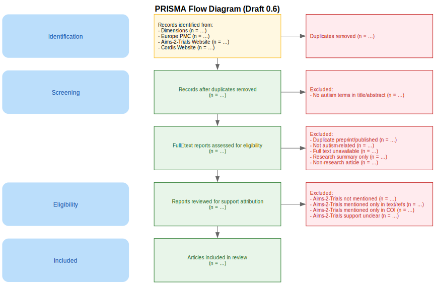

# Protocol – *Draft for Review*  #

**Study:** *Autistic Participation Reporting in Autism Research Articles Supported by AIMS-2-TRIALS: A Corpus Analysis Informed by GRIPP2-LF*  
**Version:** 0.5 – *Draft under review by research collaborators*  
**Date:** 2025-06-24

*This protocol is a preliminary draft. It is intended for collaborative feedback and discussion among project participants and may be modified or restructured based on collective input.*

*The structure and implementation of this protocol may be adapted based on the number of coders and reviewers available to participate in this study, in order to ensure feasibility while maintaining methodological transparency.*

# Table of Contents

- [Protocol – *Draft for Review*](#protocol--draft-for-review)

- [Phase A – Corpus-Building *(Performed by the First reviewer)*](#phase-a--corpus-building-performed-by-the-first-reviewer)
  - [Preliminary Considerations](#preliminary-considerations)
  - [PRISMA Flow Diagram (Draft)](#prisma-flow-diagram-draft)
  - [Step 1 – Retrieve records from Dimensions](#step-1--retrieve-records-from-dimensions)
  - [Step 2 – Retrieve records from Europe PMC](#step-2--retrieve-records-from-europe-pmc)
  - [Step 3 – Retrieve records from the CORDIS website](#step-3--retrieve-records-from-the-cordis-website)
  - [Step 4 – Retrieve records from the AIMS-2-TRIALS project website](#step-4--retrieve-records-from-the-aims-2-trials-project-website)
  - [Step 5 – De-duplication Across Sources](#step-5--de-duplication-across-sources)
  - [Step 6 – Screen for autism-related terms in title/abstract](#step-6--screen-for-autism-related-terms-in-titleabstract)
  - [Step 7 – Manual full-text screening (exclusion rules)](#step-7--manual-full-text-screening-exclusion-rules)
  - [Step 8 – Support Attribution Check](#step-8--support-attribution-check)

- [Phase B – Corpus Verification (Support Attribution)](#phase-b--corpus-verification-support-attribution)
  - [Preparatory extraction — First reviewer](#1--preparatory-extraction--first-reviewer)
  - [Reviewer training — eligibility-rules comprehension check](#2--reviewer-training--eligibility-rules-comprehension-check)
  - [Independent blind verification (secondary reviewers)](#3--independent-blind-verification-secondary-reviewers)
  - [Resolution of discrepancies](#4--resolution-of-discrepancies)
  - [Documentation & versioning](#5--documentation--versioning)

- [Phase C – Corpus Analysis Informed by GRIPP2-LF](#phase-c--corpus-analysis-informed-by-gripp2-lf)
  - [Step 1 – Create a Custom AppSmith Form Integrating GRIPP2-LF Domains and Items from the BMJ Reference](#step-1--create-a-custom-appsmith-form-integrating-gripp2-lf-domains-and-items-from-the-bmj-reference)
  - [Step 2 – Joint Calibration on a Common Subset](#step-2--joint-calibration-on-a-common-subset)
  - [Step 3 – Workload Allocation for Primary Coding](#step-3--workload-allocation-for-primary-coding)
  - [Step 4 – Secondary Quality-Control Coding](#step-4--secondary-quality-control-coding)
  - [Step 5 – Consolidation and Master Dataset Construction](#step-5--consolidation-and-master-dataset-construction)
  - [Step 6 – Descriptive and Comparative Analysis](#step-6--descriptive-and-comparative-analysis)

---

## Phase A – Corpus-Building ##
*(Performed by the **First reviewer**)*  

### Preliminary Considerations

- **Objective:** Justify the prioritization of full-text–searchable academic databases and external repositories over platforms like Scopus, PubMed, Google Scholar, or the official AIMS-2-TRIALS website.

- **Rationale:**

  - A Boolean search in **Scopus** or **PubMed** using terms like **“autism” OR “autistic” OR “ASD”** (in the **title** or in the **abstract**) and **“AIMS-2-TRIALS” OR “777394”** (in **all fields**) is **insufficient**. These platforms do **not support full-text search**, which means they may overlook mentions of Aims-2-Trials support in crucial sections such as *Funding*, *Acknowledgements*.

  - **Google Scholar**, although broad in coverage, does **not support export of structured metadata** (e.g., `.bib` format), and **does not systematically provide DOIs**, making it unsuitable for systematic corpus construction and reproducibility.

  - The [**official AIMS-2-TRIALS Publications page**](https://www.aims-2-trials.eu/) is **used as a supplementary source**, but not prioritized. It does **not include DOIs**, and there is **no standardized export option**. Moreover, it contains:
    - Duplicate entries  
    - Broken links  
    - Publications supported solely by **EU-AIMS** (the previous project), not **AIMS-2-TRIALS**

  - The **CORDIS** project page does provide **DOIs**, but similarly lacks export functionality for structured metadata.

- **Source prioritization (based on metadata quality and reproducibility):**

  1. **Dimensions** – full-text searchable; `.bib` export supported  
  2. **Europe PMC** – full-text searchable; structured export supported  
  3. **CORDIS project page** – DOIs available; no export  
  4. **Official AIMS-2-TRIALS Publications page** – no DOIs; no export

This prioritization ensures that the resulting corpus is robust, reproducible, and based on reliable metadata.

---
# PRISMA Flow Diagram (Draft) #

This diagram visualizes **Phase A – Corpus-Building** (see below) using a PRISMA-style flow.  
It was created using the **Graphviz DOT language** and is [available in the repository](./prisma_diagram/prisma_diagram.dot).

---

### Step 1 – Retrieve records from Dimensions
- **Source:** [Dimensions](https://app.dimensions.ai/) – supports full-text and grant-based searches
- **Objective:** Identify all publications that mention both autism-related terms and the AIMS-2-TRIALS project (or its grant number), using a comprehensive query across all searchable fields.
- **Action:**
  - Perform a search across **all fields** using the following query:  
    *(Coverage: records published up to **31 May 2025**, inclusive)*  
    `("777394" OR "AIMS-2-TRIALS") AND ("autism" OR "autistic" OR "ASD")`
  - Additionally, test common misspellings such as `"AIMS2TRIALS"`, `"AIMS2-TRIALS"`, and `"AIMS-2TRIALS"` to check for overlooked records.
  - Export the full result set in `.bib` format for import into JabRef.

### Step 2 – Retrieve records from Europe PMC
- **Source:** [Europe PMC](https://europepmc.org/)
- **Objective:** Identify additional autism-related publications acknowledging AIMS-2-TRIALS support.
- **Action:**
  - Perform a search across **title** and **abstract** using the following query:  
    *(Coverage: records published up to **31 May 2025**, inclusive)*  
    `(TITLE:(autism OR autistic OR ASD) OR ABSTRACT:(autism OR autistic OR ASD)) AND ("AIMS-2-TRIALS" OR "777394")`
  - Export the complete result set.

### Step 3 – Retrieve records from the CORDIS website
- **Source:** [CORDIS – AIMS-2-TRIALS project results](https://cordis.europa.eu/project/id/777394/results)
- **Objective:** Review peer-reviewed outputs linked to AIMS-2-TRIALS.
- **Action:**
  - Manually screen all records listed on the results page as of 31 May 2025.

### Step 4 – Retrieve records from the AIMS-2-TRIALS project website
- **Source:** [AIMS-2-TRIALS Publications page](https://www.aims-2-trials.eu/)
- **Objective:** Identify relevant entries on the official project website.
- **Action:**
  - Manually screen each listed publication as of 31 May 2025.

### Step 5 – De-duplication Across Sources
- **Tool:** JabRef  
- **Objective:** Ensure each unique article is represented only once in the master corpus while preserving its provenance.  
- **Action:**  
  - Assign each reference to a JabRef Source group corresponding to its origin (Dimensions, Europe PMC, CORDIS, or the AIMS-2-TRIALS website).  
  - Compare all records imported in Steps 1–4 using the DOI as the primary identifier for duplicate detection.  
  - If the same DOI appears across multiple sources, retain a single consolidated entry.  
  - Preserve source traceability by assigning the reference to all relevant Source groups, allowing a single entry to reflect multiple origins.

### Step 6 – Screen for autism-related terms in title/abstract  
- **Objective:** Ensure that only publications explicitly addressing autism are retained for eligibility assessment.  
- **Action:**  
  - Before performing this screening, verify that all entries contain an abstract. If missing, manually retrieve and add the abstract from the publisher’s website or article PDF.  
  - Exclude any record that does **not** mention **“autism”**, **“autistic”**, or **“ASD”** in the **title** *and/or* **abstract**.  
  - This step ensures topic relevance before proceeding to full-text eligibility review.

### Step 7 – Manual full-text screening (exclusion rules)  
- **Objective:** Ensure that only articles that are directly relevant to autism and that clearly acknowledge support from AIMS-2-TRIALS are included in the corpus.  
- **Action:**  
#### Exclusion Criteria  
Exclude any record that meets **one or more** of the following conditions:
  1. The record is **not a peer-reviewed research article** (i.e., an original empirical study, systematic review, or meta-analysis); therefore we exclude abstract-only entries without full text, corrigenda/corrections, books, thesis, editorials, perspective or opinion pieces, letters to the editor, and any other non-empirical content.
  2. The abstract mentions **“autism”, “autistic”, or “ASD”** but the article itself is **not directly about autism**.  
  3. The record is a **preprint** that has since been published in a peer-reviewed journal (the peer-reviewed version will be used instead).  
  4. **AIMS-2-TRIALS** (or grant **777394**) is **not cited anywhere** in the article.  
  4. **AIMS-2-TRIALS** (or grant **777394**) is **only cited in passing**—for example, listed as a **consortium** in the main text or bibliography —**without any explicit statement of funding or support**.

### Step 8 – Support Attribution Check

#### Objective  
Ensure that the corpus contains **only publications explicitly supported by AIMS-2-TRIALS**, verified against clear and reproducible criteria.

#### Action  
1. **Read the entire full text** of each remaining article (not only the *Funding*, *Acknowledgements* or *Support* sections).  
2. Identify every occurrence of **AIMS-2-TRIALS** or its grant number **777394**.  
3. Decide whether the study meets the inclusion or exclusion criteria below.

---

#### Inclusion Criteria  

A study is retained when **all** of the following conditions are met:
- The text makes an **explicit link** between AIMS-2-TRIALS and **this specific research** (e.g. *“supported by AIMS-2-TRIALS”*, *“funded by grant 777394”*, *“with the support of AIMS-2-TRIALS”*).  
- AIMS-2-TRIALS is cited **by name** or through grant **777394**.  
- A support statement appears anywhere in the article **and** fulfils at least one of these two cases:  
  1. It is located in a **Funding** or **Acknowledgements** section; **or**  
  2. It occurs elsewhere in the text but unambiguously states that the support applies to **this study**.

---

#### Exclusion Criteria  

A study is discarded when **any** of the following apply:
- The article refers solely to **EU-AIMS** and never to AIMS-2-TRIALS or grant 777394. 
- AIMS-2-TRIALS is mentioned **only** in a **Conflict of Interest (COI)** or similar disclosure, with no indication that the support relates to the current research.

---

## Phase B – Corpus Verification (Support Attribution)  

> **Scope.** Phase B provides an *independent, blinded* check of every support-attribution decision made during Phase A.  
> Secondary reviewers see only the **article title** and the **sentence-level excerpt(s)** captured by the primary reviewer; they do **not** see the primary reviewer’s eligibility code.

---

### 1 · Preparatory extraction — First reviewer (Phase A recap)  
- **Objective:** Capture transparent, citable evidence of AIMS-2-TRIALS support for every record.  
- **Action:**  
  - For **every entry** (even exclusions that mention only “support”), the primary reviewer records:  
    1. The **sentence(s)** that contain the AIMS-2-TRIALS support statement.  
    2. The **section heading** in which that statement appears (e.g. *Funding*, *Acknowledgements*, *COI*).  
    3. A binary code (*AIMS-2-TRIALS support eligible? yes / no*).  
  - An auto-attribution script confirms linkage by matching the first ten words of the extracted sentence(s) against the article full text; discrepancies are flagged for manual review.

---

### 2 · Reviewer training — eligibility-rules comprehension check
- **Objective:** Ensure uniform application of Phase-A eligibility rules before blind verification begins.  
- **Action:**  
  1. **Calibration set (20 excerpts):** Each prospective secondary reviewer independently judges *inclusion* or *exclusion* for 20 randomly sampled excerpts (section heading + sentence(s)).  
  2. **Consensus meeting (eligibility-rules focus):** Divergent judgments are revisited, with explicit reference to the Phase-A eligibility rules, under the guidance of the project lead until unanimous agreement is reached.  

---

### 3 · Independent blind verification (secondary reviewers)  
- **Objective:** Obtain an independent eligibility decision for **every** extracted passage.  
- **Action:**  
  1. **Work allocation:** Each excerpt is assigned to exactly one certified secondary reviewer who did **not** participate in Phase A extraction, ensuring complete separation of roles.
  2. **Blinded AppSmith form:** Secondary reviewers view only:  
     - the **section heading**,  
     - the **extracted sentence(s)**,
     - and, if anything is unclear, may reveal the **DOI** to consult the full text for clarification.
     The Phase-A eligibility code is hidden.  
  3. **Data captured:** Secondary reviewers enter:
    - a judgment (*Supported by AIMS-2-TRIALS?* **yes / no / unsure**), and  
    - an **optional comment** field—used only when **unsure** is selected.
    
  4. **Agreement rule:**  
      - **100 % concordance** is required between primary and secondary reviewers on the judgment (*supported by AIMS-2-TRIALS? yes / no*).  
     - Any discordance, however minor, triggers the discrepancy-resolution pathway.

---

### 4 · Resolution of discrepancies  
- **Objective:** Resolve all disagreements so that the final corpus is error-free.  
- **Action:**  
  1. **Automated flagging:** AppSmith’s *Comparison* view automatically highlights every excerpt for which the eligibility attribution recorded by the **primary reviewer** and that of the **secondary reviewer** are not in 100 % concordance.
  2. **Consensus attempt:** Primary and secondary reviewers confer (asynchronously or live) to reach agreement.  
  3. **Corpus lock:** The corpus is marked **Approved** only when every excerpt carries a unanimous eligibility label.

---

### 5 · Documentation & versioning  
- **Public release after corpus lock:**  
  - An **anonymised verification table** (with reviewer identifiers removed),  
  - the **definitive corpus list** (structured file containing year, authors, title, DOI, journal, etc.), and  
  - the corresponding **`.bib` file** are published together in the project’s public GitHub repository at the end of Phase B, enabling full external scrutiny.  

---

## Phase C – Corpus Analysis Informed by GRIPP2-LF ##

*(Coding will be carried out by **two independent teams**.  
- Each team will include **one or more primary coders**, with the exact number determined by the **people available**.  
- The **second team** will perform a quality-control review of the first team’s work.  

### Step 1 –  Create a Custom AppSmith Form Integrating GRIPP2-LF Domains and Items from the BMJ Reference
- **Objective**  
  Build a dynamic AppSmith form that reproduces every domain and item of the **GRIPP2-LF long-form** (see **Table 1** in Staniszewska et al., 2017 – <https://www.bmj.com/content/358/bmj.j3453#T1>).

- **Actions**  
  1. **Retrieve** the five GRIPP2-LF domains (*Aim, Methods, Study Results, Discussion, Reflections*) and each associated item exactly as listed in Table 1 of the BMJ article.  
  2. **Create a form field** for every item, with the recommended response options (**Yes / No / Partially / Not applicable**) and an optional free-text comment box.  
  3. **Group the fields** into collapsible panels—one panel per domain—to keep the interface compact and easy to navigate.  
  4. **Pilot-test** the form on three randomly selected articles; refine wording, layout, or response options if coders encounter usability issues.

---

### Step 2 – Joint Calibration on a Common Subset
- **Objective**  
  Ensure consistent coding practices and sufficient agreement before proceeding with full-scale data extraction.
- **Action**  
  1. For each article selected for calibration, two people independently code the same content: one as **primary coder**, the other as **reviewer**.  
  2. This calibration subset should represent approximately **10% of each coder's total assigned workload**.  
  3. Inter-rater agreement is assessed for each GRIPP2-LF item using a suitable reliability measure (e.g., **Cohen’s kappa**).  
  4. If the average agreement is acceptable (e.g., kappa ≥ 0.70 overall and no item < 0.60), the main coding phase begins.  
  5. If agreement is insufficient, discrepancies are discussed, coding instructions are revised if needed, and calibration continues on a new 5% sample until thresholds are reached.

> Coders may alternate roles between **primary coder** and **reviewer** depending on the article and study rotation.

---

### Step 3 – Workload Allocation for Primary Coding
- **Objective**  
  Code the remaining articles efficiently while maintaining complete traceability.
- **Actions**  
  1. **Randomly distribute** all articles **not used in calibration** so that each one is handled by a single primary coder (the number of coders depends on the people available).  
  2. Primary coders enter their ratings through the custom **AppSmith form**, which automatically records:  
     - coder ID,  
     - article ID/DOI,
     - timestamp.
    - the **responses for every GRIPP2-LF domain and item**.
     All entries are stored in a central **PostgreSQL database**.  
  3. Any uncertainty is documented in the form’s **comment field**, allowing flagged cases to be reviewed in subsequent quality-control steps.

---

### Step 4 – Secondary Quality-Control Coding

#### Objective  
Check the accuracy of single-coded articles and maintain inter-rater reliability throughout the project.
#### Actions  
1. The **quality-control team** draws a **stratified random sample** (≈ 15 %) from each primary coder’s batch.  
2. Team members recode these articles independently, using the same GRIPP2-LF codebook and AppSmith form.  
3. Compute inter-rater agreement (e.g., Cohen’s kappa) between each primary coder and the quality-control coding.  
4. If average κ ≥ 0.70 and no item < 0.60 for every batch, accept the primary coding.  
5. If thresholds are not met for a batch,  
   - draw an **additional 15 % sample** from that batch,  
   - recode, then recalculate κ;  
   - repeat until κ ≥ 0.70 or the entire batch has been double-coded.  
6. Log every disagreement; unresolved cases are escalated to an **arbitrating reviewer** for a final decision.

> All QC data and agreement metrics are stored in the central PostgreSQL database for auditing and reporting purposes.

---

### Step 5 – Consolidation and Master Dataset Construction

- **Objective**  
  Compile a single, consensus-level dataset that is ready for statistical analysis.
- **Actions**  
  1. **Combine** all reconciled codes—after quality-control review and any arbitrator decisions—into one **master table** (one row per article, one column for each GRIPP2-LF item).  
  2. **Append** contextual variables collected in earlier phases (e.g., publication year, journal title, study design, type of support).  
  3. **Flag** any missing or indeterminate values with a standard reason code (e.g., *NR* for “not reported”) to preserve transparency.

---

### Step 6 – Descriptive and Comparative Analysis

- **Objective**  
  Quantify how autistic-participation is reported (via GRIPP2-LF items) and explore relationships with key study characteristics.

- **Actions**  
  1. **Compute basic frequencies and percentages** for every GRIPP2-LF item  
     *(e.g., proportion of studies that explicitly state a PPI aim).*  
  2. **Assess the level of participation** whenever the relevant GRIPP2-LF item is present, by mapping the reported activities onto an adapted version of **Arnstein’s (1969) Ladder of Participation** for autism research.  
     - Classify each study along the ladder’s rungs (e.g., consultation, partnership, co-leadership).  
  3. **Cross-tabulate** both GRIPP2-LF items **and** ladder categories against variables such as:  
     - **Publication year**  
     - **Study design**  
     - **Type of support**  
  4. **Visualise the results** using bar charts, heat-maps, or similar graphics suitable for the manuscript.  
  5. **Draft a narrative synthesis** to accompany the quantitative findings, highlighting:  
     - **Common reporting gaps** – items most often missing or under-reported.  
     - **Illustrative examples** – studies with detailed descriptions of autistic participation and their ladder positions.  
     - **Observed patterns** – variations by year, design, or support context.  
     - **Implications for future work** – recommendations for strengthening autistic-participation reporting.

---

*End of protocol*
